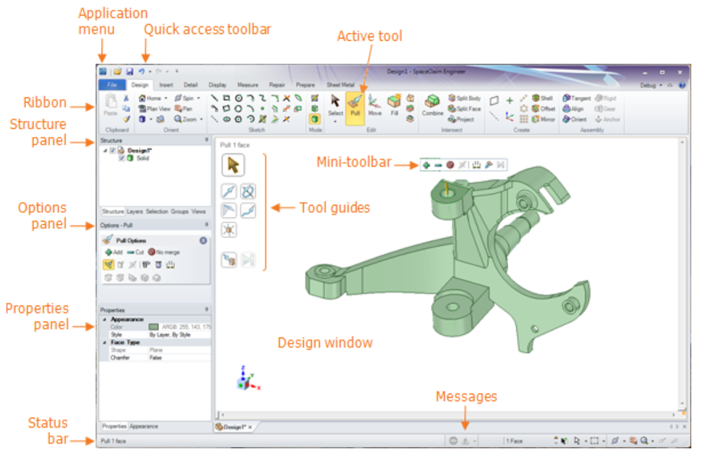

## Learning to use DesignSpark Mechanical

### [The "official" DesignSpark Mechanical Video Tutorials](https://www.youtube.com/watch?v=XyuzbKSCO90&list=PLv91f6GOku1_q3UNIORWX2ByS4g_1kknk)
* Series of 11 video tutorials
* Total time: 43 minutes

### [DSM Online Help](https://help.spaceclaim.com/dsm/6.0/en/index.html)

### [DesignSpark Mechanical tutorials](https://www.rs-online.com/designspark/creating-your-mechanical-3d-design)

### Other Video Tutorials
* Collection of [47 video tutorials from RS DesignSpark](https://www.youtube.com/playlist?list=PLv91f6GOku1_WEeZMDmspEx0ZC-odebsR) (This is an older collection, with some up to 9 years old)
* The MakerHive DesignSpark Mechanical - ZERO TO HERO [EPISODE 1](https://www.youtube.com/watch?v=WYcAZVgKWPA) shows some efficient *Best Practices*
* Best Practice: Components & Assemblies [DesignSpark Mechanical - How to - Creating components](https://www.youtube.com/watch?v=DBfSRpKoZYo)
* Basics of components & Assemblies. Also: copies vs. Instances [Understanding structure tree in SpaceClaim](https://discoveryforum.ansys.com/t/h4pkhk/understanding-structure-tree-in-spaceclaim)
* [The Structure Tree Explained (DSM06)](https://www.youtube.com/watch?v=5ynwr-laInM) (one in a series) Explains structure tree in detail
    * Produced by [Fabrication Planet Channel](https://www.youtube.com/@fabricationplanet)
    * The entire series of [All 11 videos](https://www.youtube.com/watch?v=WwM3VeYQp9I&list=PLYosAvMmVaJJJytCw-l6gik-_w6bY9B5Y)
* Intricacies of the Move Tool [Translate and rotate items in SpaceClaim using Move tool](https://discoveryforum.ansys.com/t/18pkh6/translate-and-rotate-items-in-spaceclaim-using-move-tool)
* Move a component so that its face is in alignment to another face [DesignSpark Mechanical - How to Align Object Up To](https://www.youtube.com/watch?v=sLYYv_BHJUo)

### How To make Detailed Drawings:
* Start by **right clicking a component** (part or assembly) in the assembly tree
    * Select *Open Component*
    * Click *File* -> *New* -> *Drawing Sheet*
* Watch [Detailing Tutorial](https://www.youtube.com/watch?v=fd5MbU-f2tk) for all the detailed instructions

### How to Mate and Align Components
* [Mate & Align tutorial](mate-align.md)

### **Shared** versus **Copied** parts and assemblies
* Different CAD vendors use different terminology, so this can get confusing. To keep it as simple as possible, I will restrict this discussion to the two Dynamic CAD applications:
    1. SolidDesigner (PTC Creo Elements Direct)
    2. SpaceClaim (DesignSpark Mechanical)
* Although PTC has the formidable task of maintaining both their legacy history-based CAD product (Pro-Engineer) as well as their more recently acquired Direct Modeling CAD product (Creo Elements Direct), their article [About shared parts and assemblies](https://support.ptc.com/help/creo/ced_modeling/r20.6.0.0/en/index.html#page/ced_modeling/OSDM_Main/Parts_C_9.html) does a good job of summing up the difference between *share* and *copy* as it applies to parts and assemblies. (This same distinction also applies in SpaceClaim, but SpaceClaim prefers to use the term *components* rather than *parts*.)

> It is recommended to use the *Share* functions in preference to the *Copy* functions for any parts and assemblies which are used more than once in a model. By sharing parts, you ensure that modifications made to one shared part are automatically reflected in all other shared instances of that part.
> When sharing parts or assemblies, the largest proportion of data, particularly data concerned with the geometry of a part, is shared between all instances. Consequently, this shared data exists only once in memory.
> Shared assemblies share the same parts and information about the relationship between the parts; for example, positioning of parts within the assembly.

* Toward the end of the SpaceClaim video [Basics of components & Assemblies](https://discoveryforum.ansys.com/t/h4pkhk/understanding-structure-tree-in-spaceclaim) they show how components behave if they are *copied* versus if they are *shared*. But SpaceClaim doesn't use the same terminology. Instead, they explain that it is a *best practice* when copying, to not copy a solid directly, but instead, to copy the component which contains it. This way, the copied solid will be linked to the original so that when one is modified, the other is also modified. (In other words, they are *shared*.) If you prefer to *break* that shared relationship, you can right-click on the newly copied component and then click *Source* then *Make independent*.

* Best practice in SpaceClaim is to treat assemblies the same way. Copying the assembly creates what is effectively a *shared* instance of the original assembly. Any change in one assembly (such as a moved component) would occur in the other assembly. If you want to break the shared relationship, you do it the same way: right click the newly copied assembly, then click *Source* then *Make independent*. But be aware that this is a **deep copy**, meaning that every last component and subassembly loses its shared relationship with the original. That's probably not what you want to do.
    * There is a small (but annoying) issue when making a shared copy of an assembly in DesignSpark Mechanical. Say you have an assembly on the left and you want to have an identical (shared) assembly on the right. Well, you can't give them different names. If you want them to show up in the assembly tree as *assy-left* and *assy-right*, then you have to create two new parent components with those names and then drag and drop the respective assemblies into them.

