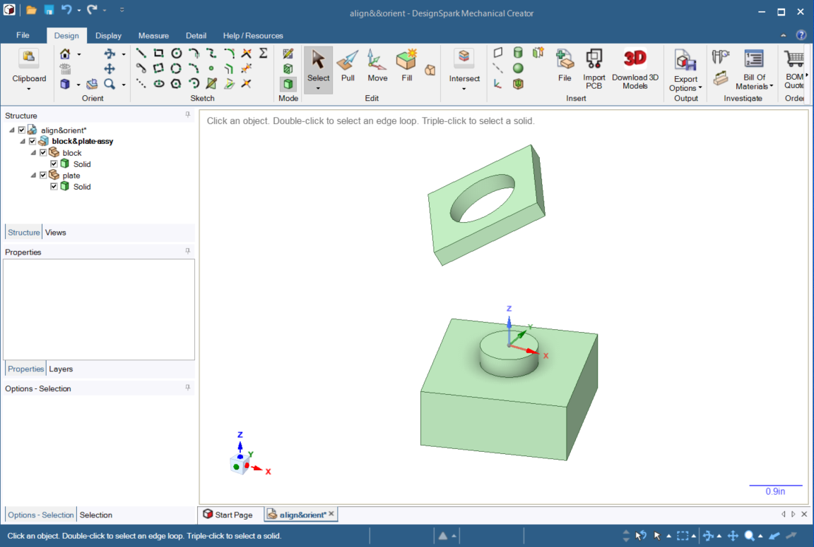
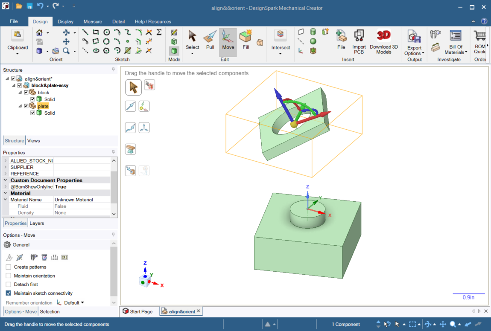
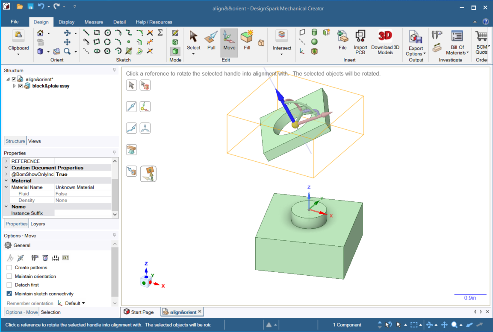
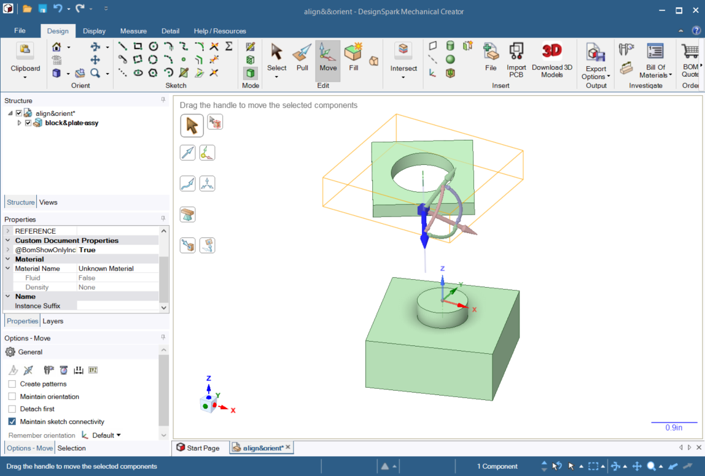
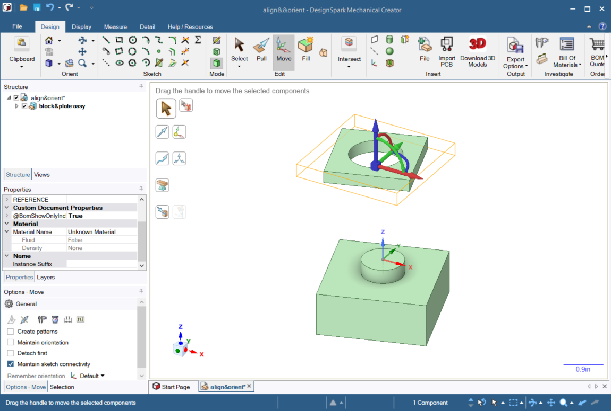
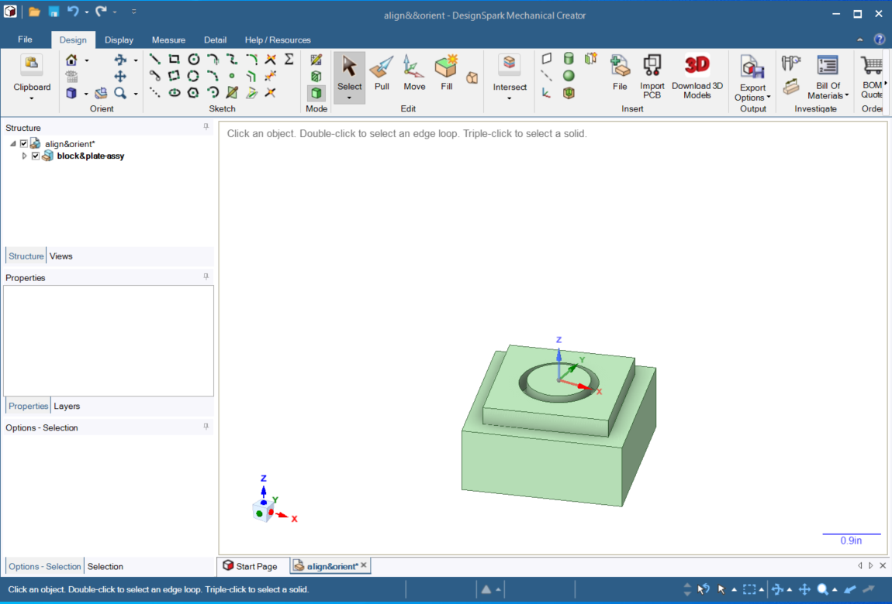

# How to align & mate components in DSM

* This tutorial shows how to align and mate a component with respect to another component in our design. We will use the **Move** tool. Here I'll use a simple example where I am adding a square plate to my design. Initially, it's not positioned where I want it. I want to move it so that it
    1. sits on the top face of the block
    2. with its hole located concentric to the round post on the top of the block
    3. and with its sides parallel with the sides of the block.

* I will use what I consider to be **Best Practices** in this example.
    1. My solids are each located within their own component.
    2. My components are placed in an assembly component which is located under the top assembly.
* Now, on to the job at hand. Select the **plate** component and click **Move**.

Next, click on the **blue translation arrow**. This causes the blue translation arrow to be selected. (The others get greyed out.) It also causes the **Orient to Object** tool guide to become enabled. (It was previously greyed out.) Click on the **Orient to Object** tool guide.

Next, click on the **top face** of the **block**. This will cause the plate to move so that the direction of its blue translation arrow will become parallel to the **surface normal** vector of the face clicked on the block. This just happens to be the Z direction (by coincidence).

Next, click on the **Anchor** tool guide then click on the **front face** of the **plate**. The blue translation arrow is still selected and that's what we want. The blue translation arrow is pointed along the surface normal of the plate's front face.

Next, click on the **Orient to Object** tool guide then click on the **front face of the block**. As before, this causes the plate to move so that the direction of its blue translation arrow will become parallel to the surface normal vector of the face clicked on the block.

OK, we have the plate oriented correctly. We just need to move it so that the center of the bottom of the hole is coincident with the center of the base of the post on the block. For this we will use **Move** tool again, but this time with the **Up To** tool guide. Right now, our Move tool has some of its DOF greyed out. We need a fresh move tool, with all DOF enabled. Click **Select** then click on **Move** again to get a fresh Move tool.

Next click on the **Anchor** tool guide to move the anchor to the center of the bottom of the hole in the plate.

The final step is to click on the **Up To** tool guide then click on the circle at the base of the post.

That's it! We're done. Click the **Select** tool to exit the Move operation. (Alternatively, you can hit the **Esc** key on the keyboard.)

Now you can import components and assemblies into your design and put them right where you want them.

